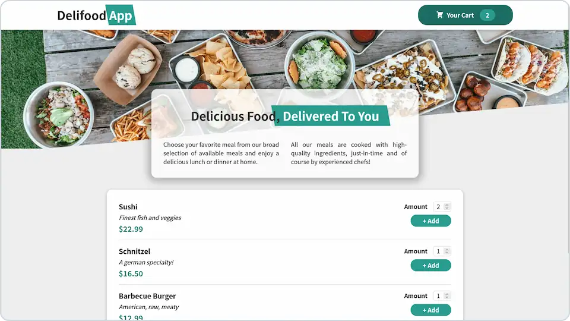

# <picture><source media="(prefers-color-scheme: dark)" srcset="delifood-logo-light.webp"><source media="(prefers-color-scheme: light)" srcset="delifood-logo.webp"></picture>

**Demo food order app made with React.**

## 💻 Screenshot

## 🛠️ Tools and technologies
`React` `React Hooks` `Context API` `CSS modules` `VS Code`

By preparing this project I learned different **hooks, context API, refs, props and more** in React.

## 🌐 Deployment
Deployed on `Netlify`.

Live preview at [dawidlehai-delifood.netlify.app](https://dawidlehai-delifood.netlify.app/).

## 🎓 Related course
This project was created as a part of the [Udemy](https://www.udemy.com/ 'Udemy') course [_React - The Complete Guide (incl Hooks, React Router, Redux)_](https://www.udemy.com/course/react-the-complete-guide-incl-redux/ 'See this course on Udemy') by [Maximilian Schwarzmüller](https://twitter.com/maxedapps 'Maximilian Schwarzmüller on Twitter').
